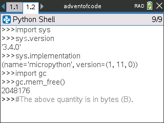

# aoc-nspire

### Latest completed problem: 2015 Day 3 Part 2 **(6/262)**

The goal is simple: **Solve every Advent of Code problem in TI-Nspire MicroPython using just over 2MB of heap space per problem.** In a world full of bloated, vibecoded slop, it's important to remember that it *is* possible to do meaningful work using small amounts of memory regardless of how high-level your programming language may seem. All it takes is human intelligence and patience.

Here are the details of my platform on a blank shell:

I never even use [`@micropython.native`](https://docs.micropython.org/en/v1.9.3/pyboard/reference/speed_python.html#the-native-code-emitter) or [`@micropython.viper`](https://docs.micropython.org/en/v1.9.3/pyboard/reference/speed_python.html#the-viper-code-emitter) due to it being unavailable as an anti-exploit measure by TI. I consider this to be just another challenge to time-optimize my code as much as possible.

## Code & Measurements

The file named `adventofcode.tns.7z` is my personal backup of the native TI-Nspire document in which all my solution code is contained. As it contains my AoC inputs, it has been encrypted. Don't mind it. It counts as source code.

Plaintext Python files stripped of AoC-provided input are provided as solution source code. A comprehensive [table of runtimes](./RUNTIMES.md) is also maintained.

You may also notice that a library called [MLStringHelper](./MLStringHelper/) is bundled in this repository. It is primarily there just to make it easier to deal with multi-line strings in Python without having to resort to egregiously inefficient lists of strings. Take a look at its [README](./MLStringHelper/README.txt) for more info.

## How I set this up

You'll notice I have a few funny looking scripts, [`get_all_inputs.sh`](./get_all_inputs.sh) and [`nspire_setup_macro.ahk`](./nspire_setup_macro.ahk).

First of all, I apologize for the very hacky nature of these. It Works On My Machine™ which is composed of a Fedora host and a Windows VM in VirtualBox which I use to run the proprietary TI-Nspire Software. If you want to reproduce this process yourself *and you get stuck,* feel free to [open an issue](https://github.com/twisted-nematic57/aoc-nspire/issues/new?labels=help+wanted) to ask for help.

`get_all_inputs.sh` gets all inputs from the Advent of Code server, caches them in plaintext files, and creates a series of Python files that I'll use as starting points for solutions to each day of each year. Then, `nspire_setup_macro.ahk` will copy-paste them into the proprietary TI-Nspire Software so that I can edit my Python files on the physical calculator itself. The pasting process, however, happens on a year-by-year basis, meaning that as of mid-2026, I have to run the AutoHotKey script 10 times just to paste all my files. The main justification for this is that it makes it easier to periodically check that everything that has been pasted so far is correct and it makes it easier to restart the pasting process after a possible error.

## AoC Policies

In compliance with [Advent of Code&#39;s policies](https://adventofcode.com/2025/about#:~:text=please%20don%27t%20include%20parts%20of%20Advent%20of%20Code%20like%20the%20puzzle%20text%20or%20your%20inputs) regarding copying and sharing, my inputs are not publicly included in this repository. Please [open an issue](https://github.com/twisted-nematic57/aoc-nspire/issues/new?labels=accidentally+left+inputs) if you discover I accidentally left one my unencrypted inputs visible.
